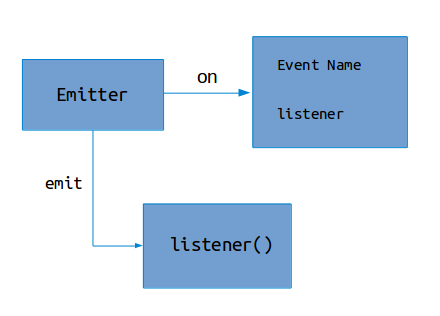
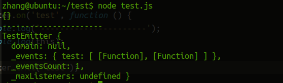

# Events

## 1. 概述

大多数Node.js的核心API都是通过异步的事件驱动模型来构建的。



能够实现这样机制的对象都是`EventEmitter`对象的实例，也就是

```javascript
const EventEmitter = require('events');

// es6 style
class TestEmitter extends EventEmitter {}

// 旧的方式
function TestEmitter(){}
TestEmitter.prototype.__proto__  = EventEmitter.prototype; 
```

这样的话，我们就可以使用事件驱动的方式来编写代码。

```javascript
var testEmitter = new TestEmitter();
// 注册事件和对应的回调函数
testEmitter.on('test', (ret) => {
    console.log(ret.name);
});
// 触发事件，执行相对应的回调函数
testEmitter.emit('test', {name : 'test'});  // test
```

###  关于this

```javascript
// 使用箭头函数
testEmitter.on('test', () => console.log(this));

// 不使用
testEmitter.on('test', function () {
    console.log('----------------------');
    console.log(this);
});
test.emit('test');
```



注意，使用箭头函数之后，在函数中的this指向就不是TestEmitter

## 2. 同步 vs 异步

通过这种事件驱动的方式，`listener`会被按照注册的顺序进行`同步`的调用（触发时立即调用）。

```javascript
testEmitter.emit('test', {name : 'test1'});  // test1
testEmitter.emit('test', {name : 'test2'});  // test2
```

这是为了确保事件回调函数能够以正确的方式执行，即可控制。

如果要想回调函数以异步的方式执行，可以采用`setImmediate()`或者使用`process.nextTick()`

```javascript
testEmitter.on('event', (ret) => {
    setImmediate(() => {
        console.log(ret.msg);
        console.log('异步执行~');
    });
})
testEmitter.emit('event', {msg : '-----------------'});
console.log('我先～');
```


## 资料来源

1. [Events API](https://nodejs.org/dist/latest-v6.x/docs/api/events.html#events_events)