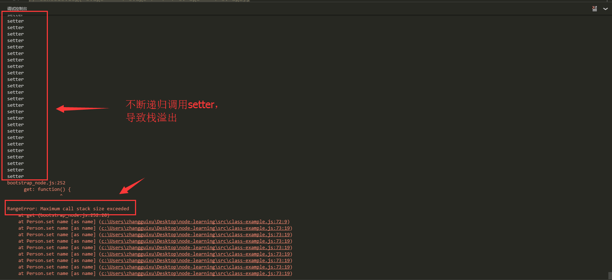
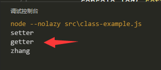
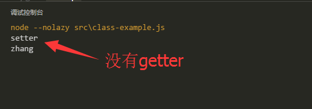
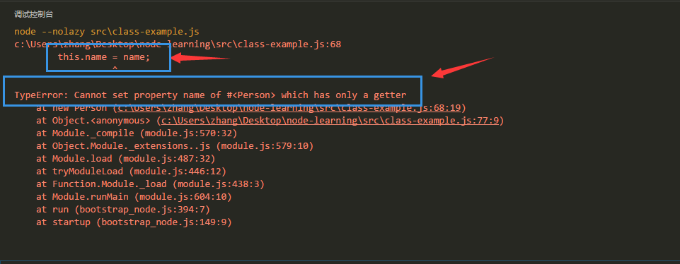

# class

## 1. 基本语法

使用`class`关键字声明一个类的基本结构

```javascript
class Person {
    // 构造函数
    constructor (name) {
        // 属性初始化
        this.name = name;
    }

    // 成员方法
    sayName () {
        console.log(this.name);
    }
}
```

使用示例

```javascript
var p = new Person("zhang"); // 实际上就是调用构造函数
p.sayName(); // zhang
```

## 3. 静态方法

使用`static`可以声明一个静态方法

```javascript
class Person {
    // 构造函数
    constructor (name) {
        // 属性初始化
        this.name = name;
    }

    // 静态方法
    static sayHi () {
        console.log("Hi~");
    }

    // 成员方法
    sayName () {
        console.log(this.name);
    }
}
```

使用示例，其实所谓的静态方法，就是`Person`函数的属性

```javascript
Person.sayHi(); // Hi~
```

## 4. 继承

使用`extends`关键字可以实现继承

```javascript
class Person {
    // 构造函数
    constructor (name) {
        // 属性初始化
        this.name = name;
    }
    // 成员方法
    sayName () {
        console.log(this.name);
    }
}
class Student extends Person {
    contructor (name, school) {
        // 调用父类的构造函数，Person.call(this, name);
        super(name); 
        this.school = school();
    }

    // override 成员方法
    sayName () {
        // 相当于Person.prototype.sayName.call(this);
        super().sayName();
        console.log("i'am from " + this.school);
    }

}
```

使用示例

```javascript
var s = new Student("zhang", "scut");
s.sayName(); // zhang i'am from scut
```

注意到在代码中出现了两次`super`，两次super其实的代表对象的是不一样的

1. 在构造函数中，super相当于`Person`
2. 在成员函数中，super相当于`Person.prototype`

## 5. setter/getter

关于setter/getter，有不少坑，我们通过一个例子来详细说明。

### 5.1 setter/getter的调用执行时机

```javascript
class Person {
    constructor (name, age) {
        this.name = name;
        this.age = age;
    }
    set name (name) {
        console.log("setter");
        this.name = name;
    }
    get name () {
        console.log("getter");
        return this.name;
    }
}

var p = new Person("zhang", 25);
```

很快，我们就会发现代码报错了



这是因为，在构造函数中执行`this.name=name`的时候，就会去调用`set name`，在set name方法中，我们又执行`this.name = name`，进行无限递归，最后导致栈溢出(RangeError)。

我们稍作修改，让这个代码可以正常执行，达到我们想要的效果。

```javascript
class Person {
    constructor (name, age) {
        this.name = name;
        this.age = age;
    }
    set name (name) {
        console.log("setter");
        this._name = name;
    }
    get name () {
        console.log("getter");
        return this._name;
    }

    // 加一个成员方法
    sayName () {
        console.log(this.name);
    }
}

var p = new Person("zhang", 25); 
p.sayName();
```

执行结果为



到这里就可以明白了，原来只要this.name中的属性名和set name/get name后面的name一致，对this.name就会调用setter/getter，也就是说setter/getter是`hook函数`，而真实的存储变量是`_name`，我们可以在代码中直接获取它。

```javascript
class Person {
    constructor (name, age) {
        this.name = name;
        this.age = age;
    }
    set name (name) {
        console.log("setter");
        this._name = name;
    }
    get name () {
        console.log("getter");
        return this._name;
    }

    // 加一个成员方法
    sayName () {
        console.log(this.name);
    }
}

var p = new Person("zhang", 25); 
console.log(p._name); // "zhang"
```

执行结果为



注意到结果并没有执行getter，因为我们直接访问了`p._name`，而不是`p.name`

### 5.2 只有getter定义只读属性

当一个属性只有getter没有setter的时候，我们是无法进行赋值操作的（第一次初始化也不行），这一点也是相当地`坑`。例如

```javascript
class Person {
    constructor (name) {
        this.name = name;
    }
    // 只有getter
    get name () {
        console.log("getter");
        return this.name;
    }
}

var p = new Person("zhang");
```

执行结果为



*当没有getter和setter时，就可以正常读写属性*

## 6. 私有属性

在上面的例子其实已经可以看到，即使有setter/getter的情况下，还是无法对属性进行封装，我们还是可以通过对象直接访问到该属性`p._name`，那么如何来实现私有的属性？

### 6.1 构造函数 + 闭包

```javascript
class Person {
    constructor (name) {
        Object.assign(this, {
            getName() {
                console.log("getter")
                return name;
            },
            setName (othername) {
                console.log("setter")
                name = othername;
            }
        });
    }

    sayName () {
        console.log(this.getName());
    }
}

var p = new Person("zhang");
p.sayName(); // zhang
console.log(p.name); // undefined
```

### 6.2 WeakMap

[WeakMap详解](./weakmap.md)

### 6.3 Symbol + 闭包

[Symbol详解](./symbol.md)

## 7. [完整示例](../../es6/class-example.js)