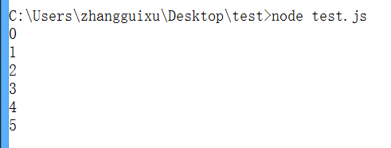

# Generator

## 1. 概述

Generator是ES6引入的实现异步操作的一种新方法，避免`callback hell`。使用Generator，开发人员可以使用同步调用的逻辑来实现异步操作，只要在需要等待的地方，使用`yield`语句即可。

## 2. 语法

### 2.1 基本语法

Generator中的语法，主要关注几点

1. function *：定义一个generator函数
2. yield：在generator函数的执行过程中起到中断/暂停执行函数的功能
3. next()：每次调用next()方法，generator函数都会执行到下一个yield语句或return语句，如果执行到yield语句的时候，如果yield语句跟着一个表达式，那么表达式的值将作为value被返回。
4. for..of：遍历所有的yield语句（return语句的返回值不会被输出）

来看一个简单的示例

```javascript
function * test () {
    yield "Hello";
    return "world";
}

func = test();
console.log(func.next()); 
console.log(func.next());
console.log(func.next());
```

执行结果为


可以看到对Generator函数的调用返回的实际上是一个遍历器，通过使用遍历器的`next()`方法来获得函数的输出（yield或return的值）。

从执行结果来看，遍历器返回一个对象，包含两个属性

* value： yield后面跟着的表达式的值，或return的值
* done ： 表示Generator函数的运行是否结束（false/true）

### 2.2 next()方法参数

yield语句只是抛出value，而并非返回value值。如果想要yield语句有返回值，可以通过next()方法的传入一个参数，这个参数可以作为上一个yield语句的返回值。

```javascript
function * f () {
    var i = 0;
    while(true){
        var reset = yield i;
        console.log("reset = " + reset);
        if(reset){
            i = -1; 
        }
        i++;
    }
}

var g = f();
console.log(g.next()); 
console.log(g.next());
console.log(g.next(true));
```


### 2.3 for-of 循环

通过for-of来遍历yield语句，来让Generator函数自动执行每一步。

*return语句的返回值不会被输出。*

```javascript
function * loop() {
    for(let index = 0; index < 6; index++){
        yield index;
    }
    return -1;
}

for(let i of loop()){
    console.log(i);
}
```



### 2.4 yield *

如果Generator函数内部需要调用另外一个generator函数，就需要使用`yield *`，示例如下：

```javascript
function * names () {
    yield "foo";
    yield "bar";
    yield "zhang";
}

function * say () {
    yield * names();
    yield "that's all the names";
}

for(let name of say()){
    console.log(name);
}
```

## 扩展阅读

要从更加底层的角度来理解generator可以阅读[什么是协程](../aio/coroutine.md)