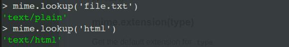
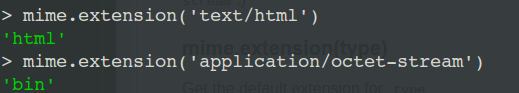
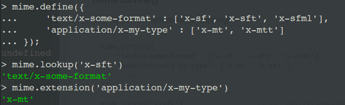

# MIME

## 概述

MIME(Multipurpose Internet Mail Extensions)多用途互联网邮件扩展类型。是设定某种扩展名的文件用一种应用程序来打开的方式类型，当该扩展名文件被访问的时候，浏览器会自动使用指定应用程序来打开。多用于指定一些客户端自定义的文件名，以及一些媒体文件打开方式。

## MIME模块作用

MIME模块其实就是一个小型MIEM类型数据库，并且提供了一些接口来判断文件的MIME类型。

*并非内置模块，需要安装*

### 类型查询

mime.lookup(path)可以通过传入的参数来判断所属的MIME类型，并且返回。

```javascript
const mime = require('mime');

mime.lookup('file.txt');
mime.lookup('html');
```



我们可以通过`mime.default_type`设置当无法查询所属的MIME类型时，默认的返回值。

### 反向查询

mime.extension(type):根据MIME类型来查询文件的后缀

```javascript
mime.extension('text/html');
mime.extension('application/octet-stream');
```



### 自定义MIME-extension映射关系

```javascript
mime.define({
    'text/x-some-format' : ['x-sf', 'x-sft', 'x-sfml'],
    'application/x-my-type' : ['x-mt', 'x-mtt']
});

mime.lookup('x-sft');
mime.extension('x-mt');
```



也可以通过配置文件的形式，加载Apache的`.types`格式文件

```javascript
mime.load('resource/proj.types');
```

## 资料

[node-mime](https://github.com/broofa/node-mime/)

