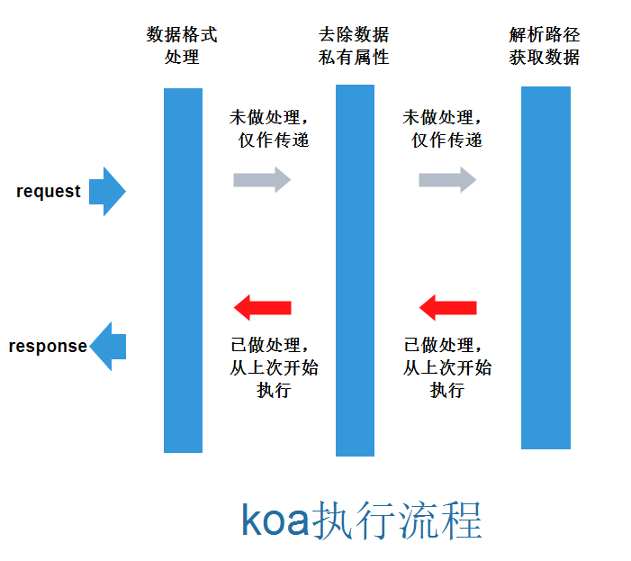

# 执行流程

koa的一大特点就是通过generator函数和yield来实现面向切面的编程，而非express中的中间件的单向流程。如图所示

## 例子讲解

我们通过先接收一个请求，然后根据路径获取对应的数据，之后在将数据进行格式处理，最后返回。按照逻辑，我们应该按照以下的流程来编写我们的代码：

但是，由于generator和yield的存在，因此我们，可以这样编写

[完整代码示例](../../koa-learning/negotiation)