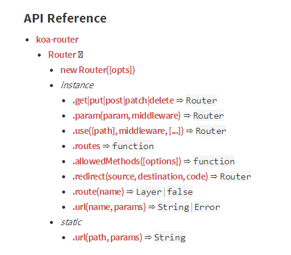

# 路由

## 1. 概述

在koa中，可以通过koa-router轻松实现路由。

```
npm install koa-router
```

## 2. 基本介绍

概览图



基本示例：

```javascript
const app = require('koa')();
const router = require("koa-router")();

router.get("/", function *(next){});

app.user(router.routes());
```

### 2.1 请求方法

**router.get|put|post|patch|delete**

```javascript
const router = require("koa-router")();

router
    .get("/", function *(next){

    })
    .post("/users", function *(next) {

    })
    .put("/users/:id", function *(next){

    })
    .del("/users/:id", function *(next){

    });
```

### 2.2 参数


## 3. 高级使用

### 3.1 多重中间件

当匹配一条路由规则时，我们可以注册多个函数对其进行处理。

```javascript
router.get(
    "/users/:id",
    function *(next) {
        this.user = yield User.findOne(this.params.id);
        yield next;
    },
    function *(next) {
        console.log(this.user);
    }
)
```

### 3.2 嵌套路由

我们可以在一个路由中使用另外一个路由，需要关注的就两点：路径和处理方法。举个例子来说明：


## 资料

[koa-router](https://www.npmjs.com/package/koa-router)