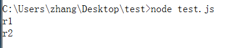
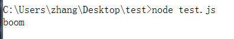
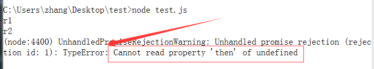

# co函数库

## 1. 概述

co函数库是著名程序员tj于2013年6月发布的一个小工具，用于Generator函数的自动执行。

```javascript
var gen = function *() {
    var f1 = yield readFile('f1.txt');
    var f2 = yield readFile('f2.txt');
    console.log(f1.toString() + ' ' + f2.toString());
};

var co = require('co');
// 自动执行generator函数，并且返回一个Promise对象
co(gen).then(() => console.log('end'));
```

## 2. co函数库的原理

而co的自动执行意味着什么？

1. 调用gen()，返回一个Iterator对象
2. 等待一个异步操作结束，调用next()方法，开始下一步异步操作。
3. 循环上述操作，直至generator执行结束。
3. 返回一个Promise对象，使其可以在执行结束时，注册回调。

使用co的前提条件是，Generator函数的yield命令后面，只能是Thunk函数或Promise对象。这是因为第二点中，需要等待异步操作结束，而异步操作只有通过Thunk和Promise进行封装，我们才能获取调用next()的方法。

接下来思考如何持续调用next()方法，答案就是递归。

到这里，我们就可以给出co函数简单实现：

```javascript
function co(generator) {
    return new Promise(function (resolve, reject) {
        var it = generator();
        function next(ret){
            var result = it.next(ret);
            if(result.done){
                resolve(result.value);
            }
            result.value.then(
                value => next(value)
            ).catch( err => reject(err))
        }
        next();
    });
}
```

测试一下

```javascript
// 一直使用这个函数作为测试
function getPromise(val, err) {
  return new Promise(function (resolve, reject) {
    if (err) reject(err);
    else resolve(val);
  });
}

function *testGen() {
    var r1 = yield getPromise('r1');
    var r2 = yield getPromise('r2');
    console.log(r1);
    console.log(r2);
} 

co(testGen);
```

执行结果为：



## 3. 打造co函数库

我们根据[co函数库的测试代码]()，来看看我们的代码存在哪些缺陷，一步步来改进。

1、捕抓错误，我们希望异步操作中的错误可以被外部的代码捕抓到。

```javascript
function getPromise(val, err) {
  return new Promise(function (resolve, reject) {
    if (err) reject(err);
    else resolve(val);
  });
}

function *testGen() {
    try{
        yield getPromise(1, new Error('boom'));
    } catch (err) {
        console.log(err.message);
    }
} 
```

那我们就需要修改一下代码

```javascript
function co(generator) {
    return new Promise(function (resolve, reject) {
        var it = generator();
        
        function next(ret){
            var result = it.next(ret);
            if(result.done){
                resolve(result.value);
            }
            result.value.then(
                value => next(value)
            ).catch( err => it.throw(err))
        }   
        next();
    });
}
```



这个时候再执行第一个测试用例，进行回归，发现原来刚刚第一个是有错误，只是因为异常没有被抛到外部，因此没有捕抓到。



原因是我们没有进行判断result.value是否为Promise对象，加入判断之后，代码修改为：

```javascript
function co(generator) {
    return new Promise(function (resolve, reject) {
        var it = generator();
        
        function next(ret){
            var result = it.next(ret);
            if(result.done){
                resolve(result.value);
            }
            if(result.value instanceof Promise){
                result.value.then(
                    value => next(value)
                ).catch( err => it.throw(err))
            } else {
                resolve(result.value)
            }
        }   
        next();
    });
}
```

到这里，我们基本通过了测试文件中[promise.js](https://github.com/tj/co/blob/master/test/promises.js)中的所有测试用例，但是真实的情况却更加的复杂，还是通过阅读co函数库的源代码来感受一下。

## 4. co源代码解析

TBD..)-

## 来源

1. [co-阮一峰](http://www.ruanyifeng.com/blog/2015/05/co.html)
2. [co-tj](https://github.com/tj/co)

