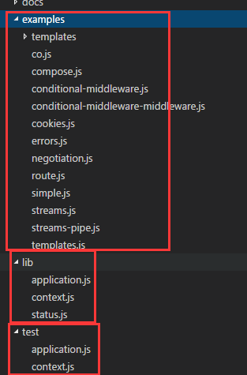

# koa-0.0.2

## 1. 概述

作为学习koa框架源码的起点，这个release版本的代码相对简单，下载源码之后，目录结构为：



源码文件就三个

* application.js 这就是koa的核心代码
* context.js 包装请求上下文
* status.js 处理HTTP状态码

## 2. application.js

### 2.1 Application对象

在此文件中，暴露的模块是一个构造函数`Application()`

```javascript
exports = module.exports = Application;

function Application() {
    if(! (this instanceof Application)) return new Application();
    // 属性
};
``` 

因此我们在使用koa时，是这样的一个形式

```javascript
const koa = require('koa');

// 实际上就是new Application()
const app = koa(); 

// 当然也可以这样写
const app = new koa();
```

Application有一个很重要的特点，那就是Application的原型对象继承了`Emitter`的原型对象，即

```javascript
Application.prototype.__proto__ = Emitter.prototype;
```

也就是说，Application对象的实例可以使用使用Emitter对象的原型方法，例如

```javascript
const koa = require('koa');
const app = koa();
app.on('error', errorHandler);
```

此外，Application对象的实例还拥有以下属性方法：

```javascript
function Application() {
    if(!(this instanceof Application)) return new Application();
    // 设置应用所处的环境，在项目的makefile中有设置
    this.env = process.env.NODE_ENV || 'development'; 
    // 出错的处理回调
    this.on('error', this.onerror);
    // 是否打印错误
    this.outputErrors = 'test' != this.env; 
    this.subdomainOffset = 2;
    // 后面用于设置响应头的，标识koa
    this.powerredBy = true; 
    // 用于JSON.stringify的第三个参数，设置空字符个数，提高json字符串的可读性
    this.jsonSpaces = 2;
    // 中间件
    this.middleware = [];

    // 请求的上下文
    this.Context = createContext();
    this.context(context);
}
```

接下来我们分三部分看代码

* app，即Application.prototype，这部分编写了我们使用koa框架所熟悉的方法。
* context，这部分关注koa是如何包装req\res请求的。
* middleware，即中间件部分的注册，调用、执行。

### 2.2 Application.prototype

app是Application.prototype的简写。

```javascript
var app = Application.prototype;
```

我们使用koa时，经常是这样的形式

```javascript
const app = require('koa')();
// 注册中间件
app.use(middlewares);
// 开启一个http服务器，监听端口
app.listen(3000);
```

**app.use()**

先说说`app.use()`，这个函数其实非常简单，就是将我们注册的generator函数加入到`middleware`这个数组中而已

```javascript
app.use = function (fn) {
    this.middleware.push(fn);
    return this;
}
```

在koa中，还有一个默认的中间件：`respond`，它当然也是一个generator函数，是处理流程中的最外一层，负责做一些响应头的设置，响应头格式的处理。

```javascript
function *respond(next) {
    this.status = 200; // 设置响应状态码
    if (this.app.powerredBy) this.set('X-Powered-By', 'koa'); // 设置一个响应头
    yield next; // 执行下一个中间件

    // 之后的根据中间件处理之后的结果，设置对应的响应状态
    var app = this.app;
    var res = this.res;
    var body = this.body;
    var head = 'HEAD' == this.method; // 是否是HEAD方法，即只获取响应头
    var onContent = 204 == this.status || 304 == this.status;

    // 404
    if (null == body && 200 == this.staus) {
        this.status = 404;
    }
    // 没有响应体，调用res.end()返回
    if (noContent) return res.end();

    // 响应体[??]
    if (null == body) {
        this.type = 'text';
        body = http.STATUS_CODES[this.status];
    }

    // 响应体为buffer类型
    if (Buffer.isBuffer(body)) {
        if (head) return res.end();
        return res.end(body);
    }

    // 响应体为string类型
    if ('string' == typeof body) {
        if (head) return res.end();
        return res.end(body);
    }

    // 响应体为二进制流
    if (body instanceof Stream) {
        if (!~body.listeners('error').indexOf(this.onerror)) body.on('error', this.onerror);
        if (head) return res.end();
        return body.pipe(res);
    }

    // 默认的json，会进行序列化处理
    body = json.stringify(body, null, this.app.jsonSpaces);
    this.length = Buffer.byteLength(body);
    if (head) return res.end();
    res.end(body);
}
```

**app.listen()**

再来看看`app.listen()`，它其实是一个语法糖，这个函数实际上是通过`http.createServer()`来创建一个http服务器，源代码为

```javascript
app.listen = function () {
    var server = http.createServer(this.callback());
    return server.listen.apply(server, arguments);
}
```

我们查看一下`http.createServer()`的API可以发现这个方法中的参数实际上是`[requestListener]`，也就是说`this.callback()`会在接收到客户端请求时进行调用。到这里就可以明白了，koa通过`this.callback()`的返回值（是一个接收req,res参数的回调函数）将一连串的中间件挂载到处理客户端请求的流程中来。

*app.callback()*

而在`app.callback()`即`this.callback()`中，主要做的事情就是

1. 合并所有的中间件（包含默认的generator函数`respond`），将其包装为一个generator函数`gen`。
2. 使用this.Context()创建一个接收req、res参数的回调函数，处理请求。
3. 使用`co`执行`gen`，开始进行真正的处理流程，即中间件处理。

app.callback()代码如下

```javascript
app.callback = function () {
    var mw = [respond].concat(this.middleware);
    var gen = compose(mw);
    var self = this;
    return function (req, res) {
        var ctx = new self.Context(self, req, res);

        co.call(ctx, gen)(function (err) {
            if(err) ctx.onerror(err);
        });
    }
}
```

其中`self.Context`就是`createContext()`，这个函数很简单，实际上就是返回一个构造函数Context，用于构造Context对象的实例，并且有以下属性：

```javascript
function createContext() {
    return function Context(app, req, res) {
        this.app = app;
        this.req = req;
        this.res = res;
        this.cookies = new Cookies(req, res);
        this.onerror = this.onerror.bind(this);
    }
}
```

这个Context应就是接收一个请求时，保存上下文的值

* req: 请求
* res: 响应
* cookie: cookie
* onerror: 出错的处理

因此，在`Application`对象的实例中的属性`this.Context`是一个Context构造函数。

**app.onerror()**

这个函数只要是用于处理错误的回调

```javascript
app.onerror = function (err) {
    if (!this.outputErrors) return;
    if (err) ctx.onerror(err);
}
```

**app.context**

从代码上看，这个原型函数将一个传入的对象属性到Context对象的原型对象上：

```javascript
app.context = function (obj) {
    var ctx = this.Context.prototype;
    var names = Object.getOwnPropertyNames(obj);

    names.forEach(function (name) {
        var descriptor = Object.getOwnPropetyDescriptor(obj, name);
        Object.defineProperty(ctx, name, descriptor);
    });

    return this;
}
```

在Application构造函数的定义中，可以看到，它将context.js中定义的对象context中的方法都合并到了Context的原型对象上。

```javascript
var context = require('./context');
function Application () {
    this.context(context);
}
```

下面就来看看context.js中的对象定义了哪些方法。

## 3. context.js

这个文件的代码学习主要知识点都是node中关于网络（http）编程。

我们首先来看文件中的模块依赖：

* Negotiator: [模板的文档地址](https://github.com/jshttp/negotiator),这个主要是处理
* querystring: 处理请求的url，进行解析，可以获取请求路径，参数等等。


## 学习总结

良好的注释风格，相当值得学习，非常细心的文档和例子。


