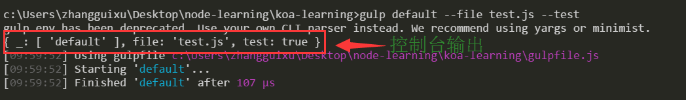

# gulp

## 1. 入门

1. 全局安装

    ```shell
    npm install -g gulp
    ```

2. 作为项目开发依赖

    ```shell
    npm install --save-dev gulp
    ```

3. 在项目根目录下，创建一个名为`gulpfile.js`的文件

    ```javascript
    var gulp = require("gulp");

    gulp.tast("default", function () {
        // 任务代码
    });
    ```

4. 运行gulp，执行默认任务

    ```shell
    # 运行默认任务
    gulp <task>
    ```

## 2. 读取命令行参数

我们可以通过`gulp.env`来获取命令行参数，例如

```shell
gulp default --file test.js --test
```

可以在`gulpfile.js`中根据`gulp.env`来获取这两个命令行参数，输出结果为



即使用`--key value`的形式，当没有value的情况下，则key的值为true。

有了命令行参数之后就可以根据传递参数的不同，执行不一样的构建脚本。

*在控制台的输出也可以看到，如今推荐的做法是安装yargs或minimist来获取命令参数，由于目前暂时够用了，就不纠结了。*

## 资料

1. [中文官网](http://www.gulpjs.com.cn/docs/getting-started/)
2. [常用插件](http://www.mamicode.com/info-detail-517085.html)