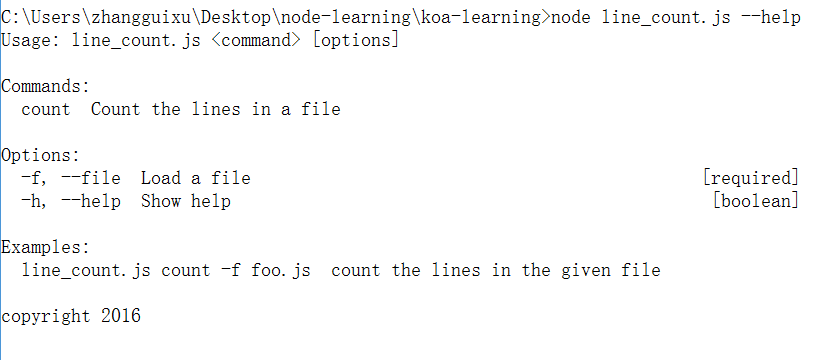

# yargs

作用：获取命令参数

安装：

```shell
npm install yargs --save-dev
```

## 使用示例

例如，我们执行gulp，有参数

```shell
gulp test -c hello-world
```

```javascript
// 获取命令参数
const argv = require("yargs").argv;

// 获取-c参数
console.log(argv.c); // hello-world
```

## 创建参数使用手册

我们可以使用`yargs`来创建一个命令参数使用手册，例如我们制作一个统计文件行数的工具，需要通过`-f`来指定文件，当用户执行命令时，在没有`-f`的情况下，会提示帮助信息。

```javascript
var argv = require("yargs")
    .usage("Usage:$0 <command> [options]") // 使用语法
    .command("count", "Count the lines in a file") // 工具说明
    .example("$0 count -f foo.js", "count the lines in the given file") // 使用示例
    .alias("f", "file") // 可以使用-f --file
    .describe("f", "load a file") // 参数说明
    .help("h") // 指定help
    .alias("h", "help") // 可以使用-h --help
    .epilog("copyright 2016") // 一些声明
    .argv;

var fs = require('fs');
var s = fs.createReadStream(argv.file);
 
var lines = 0;
s.on('data', function (buf) {
    lines += buf.toString().match(/\n/g).length;
});
 
s.on('end', function () {
    console.log(lines);
});
```

执行结果如下

