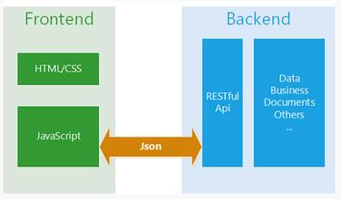

# 模板

## 1. 简述

模板的存在，实现了代码的分离，提高项目的可维护性，当然也提高了开发的效率。

模板的本质就是字符串拼接，返回html代码段。

1. 前端模板，即在浏览器中，会将返回html代码段进行解析，之后再进行渲染。
2. 服务端模板，在服务端根据数据和模板，生成对应的html代码段（静态文件），再返回给客户端。

Node的出现，可以实现前后端模板的统一（技术栈一致），避免了一种尴尬，就是前端做好静态页面和写好js逻辑之后，考到后台项目中，这样出现两种情况，要么

1. 前端还要checkout后台的项目进行，需要学习后端页面脚本语言，然后再次进行开发。
2. 后台要去改前端写好的页面，往往效果也不怎么好。

*以上情况是指需要服务器端渲染的情况下，前后端分离使用json等接口通信的不属于此类情况。*

## 2. 服务端渲染(SSR)

在Ajax技术出现之后，前后端分离可以得到很好的实现

这种方式在一定程度上改变了服务端渲染的方式，但是不得不说，服务端渲染的方式的存在，有其特定的优势。

1. SEO(搜索引擎优化)

    谷歌和Bing可以很好地索引同步的JavaScript应用。同步在这里是个关键词。如果应用启动时有一个加载动画，然后内容通过ajax获取，那爬虫不会等待他们加载完成。

2. 客户端的网络比较慢

    用户可能在网络比较慢的情况下从远处访问网站 - 或者通过比较差的带宽。 这些情况下，尽量减少页面请求数量，来保证用户尽快看到基本的内容。

3. 渲染速度

    客户端可能会因为性能原因，要完成渲染-》解析-》呈现的过程比较慢，预先在服务器端渲染好之后，可以提高整个页面的呈现速度。

## 3. 前后端通用模板

可以用于Node后端的模板很多，最早的有`jade`，`ejs`等，前端的模板就更多了，数不清。

本项目暂定`xtemplate`，原因是前后端都可以使用。

